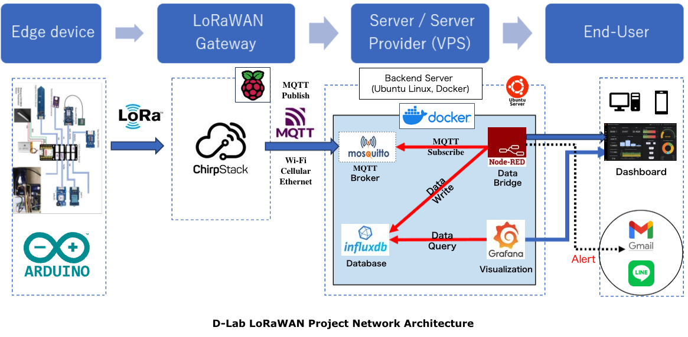
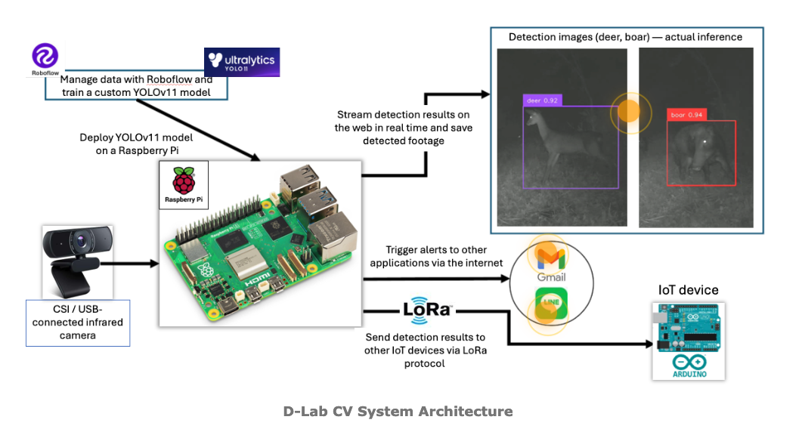

# Design and Deployment of a LoRaWAN-Based Smart Village IoT System  
**SEEDs LLP – D-Lab**

---

## Links

- 🔗 Project Website (Smart Village): https://seeds-dlab.com/en/smart-village  
- 🚀 Live Dashboard Demo (Node-RED): https://farmer-b.seeds-dlab.com/dashboard  
  Real-time monitoring and alert interface for field-deployed sensor and system data

---

## Overview

This project presents the design, implementation, and real-world deployment of a LoRaWAN-based IoT system for smart village applications.  

The system integrates edge devices, wireless communication, cloud infrastructure, and data visualization to support practical use cases such as environmental monitoring, asset tracking, and community safety.

---

## System Architecture

Edge Devices → LoRaWAN Gateway → ChirpStack → MQTT → Node-RED → InfluxDB → Visualization (Grafana / Node-RED Dashboard)

---

## System Description

The system is designed as an end-to-end IoT infrastructure based on LoRaWAN.

Edge devices (Arduino-based sensors and Raspberry Pi modules) collect environmental and positional data and transmit it via LoRa to self-deployed gateways. These gateways forward data to a ChirpStack network server.

Data is transmitted via MQTT to a cloud-based backend (VPS), where it is processed using Node-RED. The resulting data is stored in InfluxDB and visualized through Grafana for time-series analysis and Node-RED dashboards for real-time monitoring.

The system supports real-time alerts and remote monitoring, enabling practical deployment in smart village environments.

---

## Edge AI / Computer Vision System

In addition to the IoT infrastructure, the system incorporates an edge-based computer vision module for real-time wildlife detection and monitoring.

### Description

A lightweight computer vision model is deployed on a Raspberry Pi to detect wildlife activity in real time.

- Detection is performed locally on the edge device  
- Events trigger alerts to end users  
- Designed for low-latency operation without continuous cloud dependency  

This enables practical deployment in rural environments where connectivity may be limited.

---

## Features

- Real-time environmental monitoring (temperature, humidity, soil moisture, etc.)
- GPS-based tracking for assets and mobility use cases
- Edge-based wildlife detection using computer vision
- Alert system via messaging services (LINE / Slack / Email)
- End-to-end data pipeline (LoRaWAN → MQTT → processing → visualization)
- Deployment on Raspberry Pi and VPS (Docker-based backend)

---

## Deployment Context

This system is based on a real-world deployment, including:

- Multiple self-deployed LoRaWAN gateways (~5 km coverage)
- Field-deployed sensors for environmental monitoring
- Integration of edge AI modules (Raspberry Pi-based)
- Comparative deployment contexts in Japan and Germany

---

## My Role

- Designed and deployed the LoRaWAN network architecture (gateway + backend)
- Configured and managed ChirpStack-based infrastructure
- Built end-to-end data pipeline (MQTT → Node-RED → InfluxDB → Grafana/Node-RED)
- Deployed and maintained VPS-based backend using Docker
- Integrated edge-based computer vision module on Raspberry Pi
- Developed system integration across edge, network, and cloud layers
- Custom-built edge devices (Arduino-based) for sensor data acquisition
- Developed and deployed the company website using HTML/CSS and Python (Flask)
- Built a lightweight GPS tracking interface using Google Apps Script, enabling real-time visualization of location data
- Implemented secure service exposure using Cloudflare Tunnel, avoiding direct port forwarding and improving deployment security

---

## Results

- Successfully deployed multiple LoRaWAN gateways
- Achieved real-time environmental and GPS data monitoring
- Built operational dashboards for continuous system visualization
- Implemented alert-based monitoring system for practical field use
- Demonstrated system functionality across multiple deployment contexts (Japan / Germany)

---

## Tech Stack

- LoRaWAN (ChirpStack)
- MQTT (Mosquitto)
- Node-RED
- InfluxDB (time-series database)
- Grafana/Node-RED (data visualization)
- Docker (containerized backend deployment)
- Raspberry Pi (edge computing & LoRaWAN gateway)

---

## Notes

This repository is based on a real deployment.  
Sensitive data, credentials, and proprietary configurations have been removed or anonymized.
