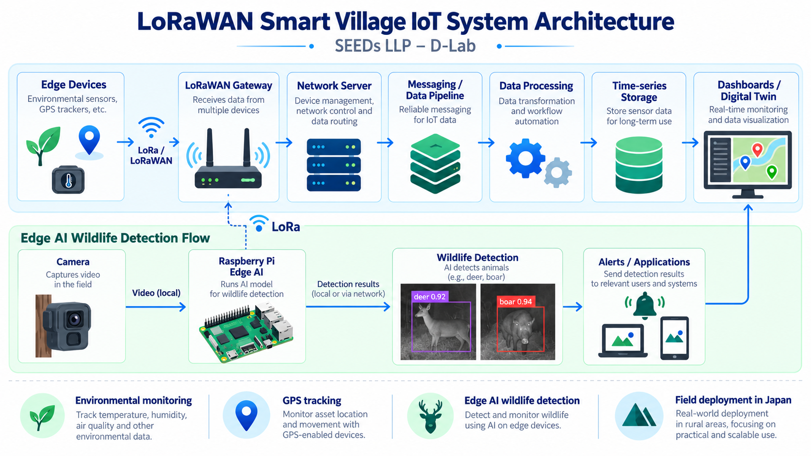
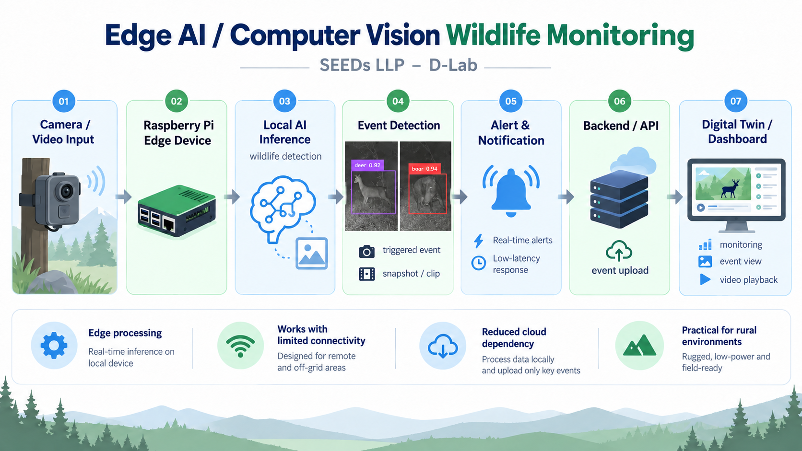
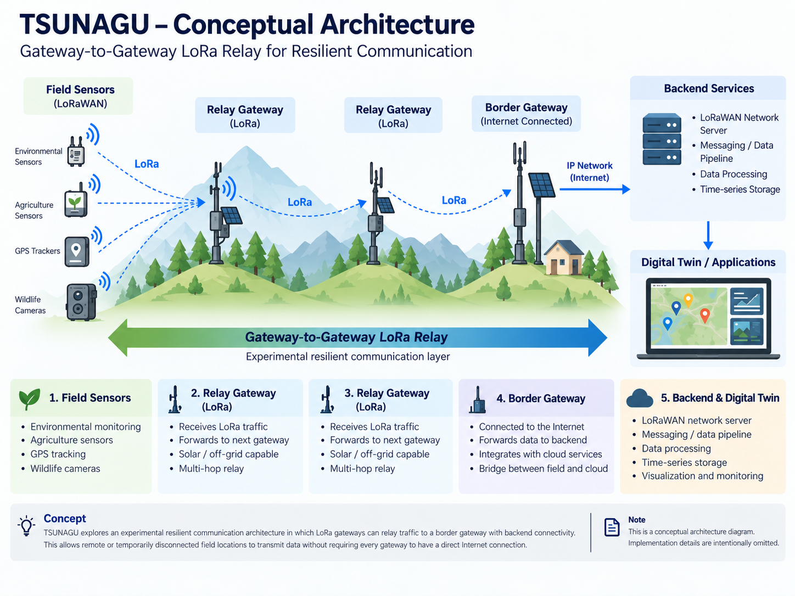

# LoRaWAN Smart Village IoT System

**SEEDs LLP – D-Lab**

Real-world IoT infrastructure integrating **LoRaWAN, smart agriculture, GPS tracking, Edge AI, resilient communications, and Digital Twin visualization**.

Primarily deployed and tested in rural Japan.

---

## Links

- 🔗 [Smart Village Project Website](https://seeds-dlab.com/en/smart-village)
- 🚀 [Live Monitoring Dashboard](https://farmer-a.seeds-dlab.com/dashboard)

---

## Project Overview

The system connects field sensors and edge devices with self-deployed LoRaWAN gateways, backend services, and real-time monitoring applications.

Key applications include:

- Environmental and agricultural monitoring
- GPS-based tracking
- Edge AI wildlife detection
- Real-time alerts
- Digital Twin visualization
- Resilient LoRa gateway communication

---

## System Architecture

The platform uses LoRaWAN for field communication, ChirpStack for network management, MQTT and Node-RED for data processing, and InfluxDB/Grafana for storage and visualization.

---

## Digital Twin

The Digital Twin provides a unified view of:

- Sensors
- GPS trackers
- LoRaWAN gateways
- TSUNAGU relay gateways
- Wildlife detection events
- Event video

It integrates data from the LoRaWAN backend and REST APIs into a single operational interface.

---

## Edge AI Wildlife Monitoring

A Raspberry Pi performs local wildlife detection using computer vision.

Detected events can:

- Trigger alerts
- Save relevant images/video
- Send results to other systems
- Appear in the Digital Twin

Processing at the edge reduces bandwidth requirements and cloud dependency.

---

## TSUNAGU — Resilient Communications

TSUNAGU is an experimental gateway-to-gateway LoRa relay architecture for environments where direct Internet connectivity may be unavailable.

The concept allows remote relay gateways to forward traffic toward a border gateway connected to the backend.

Current development includes:

- Multi-hop LoRa relay communication
- Border / relay gateway architecture
- Digital Twin integration
- Off-grid power testing
- Field testing in Japan

> TSUNAGU is under active development. Detailed implementation, routing logic, configuration, and security-related information are intentionally not public.

---

## My Role

I worked across the complete edge-to-cloud stack:

- Designed and deployed the LoRaWAN infrastructure
- Installed and configured multiple gateways
- Configured ChirpStack, MQTT, Node-RED, InfluxDB, and Grafana
- Built custom LoRaWAN sensor devices
- Integrated GPS tracking
- Integrated Raspberry Pi-based computer vision
- Developed Digital Twin backend/API integration
- Developed the TSUNAGU gateway-relay architecture
- Deployed Docker-based Linux backend services
- Developed and maintained web applications and infrastructure

---

## Technology Stack

**Wireless:** LoRa, LoRaWAN, ChirpStack, MQTT  
**Edge:** Raspberry Pi, Seeed XIAO, LoRa-E5, SX1302 / WM1302  
**Backend:** Linux, Docker, Node-RED, Python, Flask, REST APIs  
**Data:** InfluxDB, PostgreSQL, Redis  
**Visualization:** Grafana, Node-RED Dashboard, Digital Twin  
**Infrastructure:** Cloudflare, VPS, Raspberry Pi gateways

---

## Deployment

The main field deployment is in **Japan**, including:

- LoRaWAN gateways
- Environmental sensors
- Smart agriculture devices
- GPS tracking
- Wildlife monitoring
- TSUNAGU relay testing
- Digital Twin integration

---

## Notes

This repository documents a real-world deployment.

Sensitive implementation details are intentionally omitted, including credentials, security keys, production configuration, detailed TSUNAGU routing logic, and proprietary workflows.